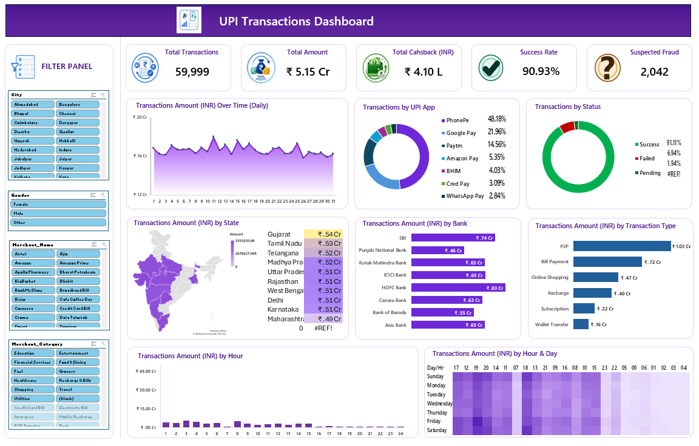

# 📊 UPI Transactions Dashboard — Excel
An interactive **UPI Transactions Dashboard** built using **Microsoft Excel** to analyze transaction performance, payment behavior, banking patterns, time-based trends, geographic performance, and suspected fraud.

---

## 📌 Project Overview
The purpose of this project is to transform raw UPI transaction data into a clear and interactive dashboard that can help users understand key transaction trends and business KPIs.

The dashboard brings multiple dimensions of UPI transactions together in one view, making it easier to identify patterns and compare performance.

---

## 🎯 Objectives

* Analyze overall UPI transaction performance.

* Monitor total transaction volume and transaction value.

* Understand transaction success, failure, pending, and refund patterns.

* Compare UPI apps based on transaction activity.

* Analyze transaction performance across states and banks.

* Identify high-activity transaction hours and days.

* Analyze different transaction types.

* Monitor suspected fraud transactions.

* Create an interactive and easy-to-understand dashboard.

---

## 📊 Dashboard KPIs
| KPI                              |   Value   |
|----------------------------------|----------:|
| **Total Transactions**           | 59,999    |
| **Total Transaction Amount**     | ₹5.15 Cr  |
| **Total Cashback**               | ₹4.10 L   |
| **Success Rate**                 | 90.93%    |
| **Suspected Fraud Transactions** | 2,042     |

---

## 🔍 Dashboard Features

### 1. Transaction Performance 

* Total transactions
* Total transaction amount
* Total cashback
* Success rate
* Suspected fraud transactions

---

### 2. UPI App Analysis

Comparison of transaction activity across:
* PhonePe
* Google Pay
* Paytm
* Amazon Pay
* BHIM
* CRED Pay
* WhatsApp Pay

---

### 3. Transaction Status Analysis

The dashboard analyzes transactions by:
* Successful
* Failed
* Pending
* Refunded

--- 

### 4. Geographic Analysis

* State-wise transaction amount
* Comparison of transaction performance across Indian states

---

### 5. Bank Analysis

* Transaction amount by bank
* Comparison of major participating banks

---

### 6. Transaction Type Analysis

Analysis across different transaction types such as:

* UPI
* Bill Payment
* Online Shopping
* Recharge
* Subscription
* Wallet Transfer

---
### 7. Time-Based Analysis

* Daily transaction trends
* Hourly transaction trends
* Day-wise transaction patterns
* Identification of high-activity periods

---

### 8. Fraud Monitoring

* The dashboard includes a KPI for suspected fraud transactions to provide a quick view of potentially risky transaction activity.

--- 

### 9. Interactive Filters

* Slicers/filters allow users to explore the data based on dimensions such as:
* Gender
* Transaction Type
* Merchant Name
* Merchant Category

---

## 🛠️ Tools & Skills Used

* Microsoft Excel
* Pivot Tables
* Pivot Charts
* Slicers
* Data Analysis
* Data Visualization
* KPI Development
* Dashboard Design
* Interactive Reporting

---

## 📈 Dashboard Layout

The dashboard contains:

* KPI cards at the top for quick performance monitoring
* Line/area charts for transaction trends
* Donut charts for UPI app and transaction status analysis
* Map visualization for state-wise performance
* Bar charts for bank and transaction type analysis
* Hourly and day-wise transaction visualizations
* Interactive filter panel for detailed exploration

---

## 🧠 Key Learning

This project helped me understand that dashboard development is not only about creating charts. A good dashboard should answer meaningful business questions and present the results in a simple and understandable way.

Through this project, I strengthened my practical skills in:

* Data analysis
* KPI selection and development
* Pivot-based analysis
* Interactive reporting
* Data visualization
* Dashboard design
* Business-focused storytelling

---

## 📂 Project Structure

```text 
upi-transactions-excel-dashboard/
| README.md
├── UPI Transactions Dashboard.xlsx
├── UPI transaction dataset.xlsx
└── dashboard-image.png
```


---
# 📂 Repository Contents

## `dashboard/`

Contains the main Excel workbook used for the project.

**File:**

`UPI-transaction-dashboard.xlsx`

The workbook contains the Excel-based dashboard and associated project work.

---

## `datset/`

Contains raw dataset.

**File:**

`UPI-transaction-dataset.xlsx`

---

## `dashboard-image/`

Contains the preview image of final dashboard

**image:**

`dashboard-image.png`

---

## 🚀 How to Use

* Download or clone this repository.
* Open the Excel workbook.
* Go to the UPI Dashboard sheet.
* Use the available slicers/filters to explore the data.
* Interact with the charts and KPIs to analyze different transaction dimensions.

---

## 📸 Dashboard Preview


---
⭐ If you find this project useful, feel free to explore the dashboard and share your feedback.
